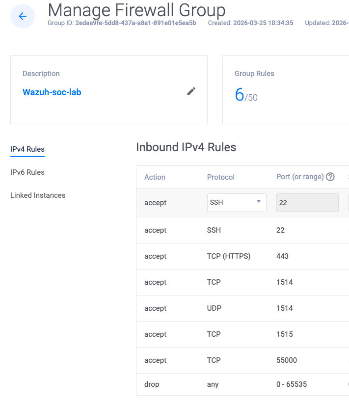

# Hybrid SOC Home Lab

A cloud-hybrid Security Operations Center (SOC) home lab built with Wazuh 4.14.4 SIEM on a Vultr VPS, monitoring Windows 11 Pro and Ubuntu endpoint VMs running locally on UTM (MacBook M4).

## Architecture

```
┌──────────────────────────────────────────────────────────────────────┐
│                        CLOUD (Vultr VPS)                             │
│                                                                      │
│   ┌──────────────────────────────────────────────────────────────┐   │
│   │                  Wazuh Server (All-in-One)                   │   │
│   │                  Ubuntu 22.04 LTS | 8 GB RAM                 │   │
│   │                                                              │   │
│   │   ┌─────────────┐  ┌──────────────┐  ┌─────────────────┐   │   │
│   │   │   Wazuh      │  │    Wazuh     │  │     Wazuh       │   │   │
│   │   │   Manager    │  │   Indexer    │  │   Dashboard     │   │   │
│   │   │  (port 1514) │  │             │  │  (port 443)     │   │   │
│   │   └─────────────┘  └──────────────┘  └─────────────────┘   │   │
│   └──────────────────────────────────────────────────────────────┘   │
│                                                                      │
│   Firewall: Vultr FW Group + UFW (all rules locked to home IP)      │
└──────────────────────┬───────────────────────┬───────────────────────┘
                       │ Port 1514 (events)    │ Port 1514 (events)
                       │ Port 1515 (enroll)    │ Port 1515 (enroll)
                       │                       │
┌──────────────────────┴──────┐  ┌─────────────┴──────────────────────┐
│     LOCAL (UTM - MacBook)   │  │      LOCAL (UTM - MacBook)         │
│                             │  │                                     │
│   ┌───────────────────┐    │  │   ┌───────────────────────────┐    │
│   │  Ubuntu VM         │    │  │   │  Windows 11 Pro VM         │    │
│   │  Agent: ubuntu-    │    │  │   │  Agent: Computer2          │    │
│   │  endpoint          │    │  │   │                             │    │
│   │  Wireshark         │    │  │   │  Attack Simulations:       │    │
│   │  Hydra / Nmap      │    │  │   │  - Windows Login Failures   │    │
│   │                    │    │  │   │  - Audit Log Cleared        │    │
│   │  Attack Simulations│    │  │   │  - Windows System Errors    │    │
│   │  - SSH Brute Force │    │  │   └───────────────────────────┘    │
│   │  - Nmap Recon      │    │  │                                     │
│   │  - Failed Logins   │    │  │                                     │
│   └───────────────────┘    │  │                                     │
└─────────────────────────────┘  └─────────────────────────────────────┘
```

## Components

| Component | Platform | Role |
|---|---|---|
| Wazuh 4.14.4 (All-in-One) | Vultr VPS (Ubuntu 22.04) | SIEM — Manager, Indexer, Dashboard |
| Ubuntu VM (`ubuntu-endpoint`) | UTM on MacBook M4 | Monitored endpoint + attack platform |
| Windows 11 Pro VM (`Computer2`) | UTM on MacBook M4 | Monitored endpoint |
| Wireshark | Ubuntu VM | Network packet analysis |

## Firewall Configuration

Dual-layer firewall architecture — all rules restricted to my home IP only:

### Layer 1: Vultr Firewall Group (`Wazuh-SOC-Lab`)

| Port | Protocol | Purpose |
|---|---|---|
| 22 | TCP | SSH server management |
| 443 | TCP | Wazuh Dashboard |
| 1514 | TCP | Agent event communication |
| 1515 | TCP | Agent enrollment |
| 55000 | TCP | Wazuh REST API |



### Layer 2: UFW on the Wazuh Server

Same five rules, same home IP restriction. Defense in depth.

## Attack Simulations & MITRE ATT&CK Mapping

### Linux (Ubuntu VM — `ubuntu-endpoint`)

| Attack | Tool | MITRE Technique | Wazuh Rule IDs |
|---|---|---|---|
| SSH Brute Force | Hydra v9.5 | T1110 — Brute Force | 5710, 5712 |
| Network Reconnaissance | Nmap 7.94 | T1046 — Network Service Discovery | — |
| Failed SSH Login Attempts | Manual / sshd | T1110 — Brute Force | 5710 |

### Windows (Windows 11 Pro VM — `Computer2`)

| Attack | Method | MITRE Technique | Wazuh Rule IDs |
|---|---|---|---|
| Login Failures | Manual failed logon attempts | T1110 — Brute Force | 60122 |
| Audit Log Cleared | Windows Event Log cleared | T1070.001 — Indicator Removal: Clear Windows Event Logs | 63103 |
| Windows System Errors | Triggered system error events | Windows System Event Monitoring | 61102 |

## Project Structure

```
hybrid-soc-lab/
├── README.md                          # This file
├── architecture/
│   └── diagram.png                    # Lab architecture diagram
├── firewall/
│   └── vultr-firewall-group.png       # Vultr Firewall Group configuration
├── screenshots/
│   ├── Audit-clean/                   # Audit log cleared — screenshots & evidence
│   ├── brute-force/                   # SSH brute force with Hydra
│   │   └── brute-force.md
│   ├── failed-login/                  # Linux SSH failed login attempts
│   ├── nmap-scan/                     # Nmap network reconnaissance
│   │   └── nmap-scan.md
│   ├── windows-login-failure/         # Windows logon failure alerts
│   └── windows-sys-error/             # Windows system error events
├── dashboard/
│   └── dashboard-setup.md             # Wazuh dashboard screenshots & notes
├── setup/
│   ├── agent-setup.md                 # Agent enrollment steps
│   ├── vultr-setup.md                 # Vultr VPS provisioning steps
│   └── wazuh-install.md               # Wazuh all-in-one installation
└── WireShark/                         # Packet capture screenshots
```

## Key Learnings

- Deployed and managed a cloud-based SIEM (Wazuh) with dual-layer firewall hardening
- Enrolled cross-platform agents (Linux `ubuntu-endpoint` + Windows `Computer2`) for centralized log collection
- Simulated real-world attacks and triaged alerts in the Wazuh dashboard
- Mapped all attack simulations to the MITRE ATT&CK framework
- Detected defense evasion via audit log clearing (T1070.001) in addition to brute force and recon techniques
- Performed packet analysis with Wireshark to observe attack traffic at the network level
- Monitored vulnerability detection across severity levels (Critical, High, Medium, Low)
- Ran CIS Ubuntu 24.04 LTS Benchmark compliance assessment via Wazuh's Security Configuration Assessment module
- Practiced defense-in-depth with Vultr firewall groups + UFW host-based firewall
